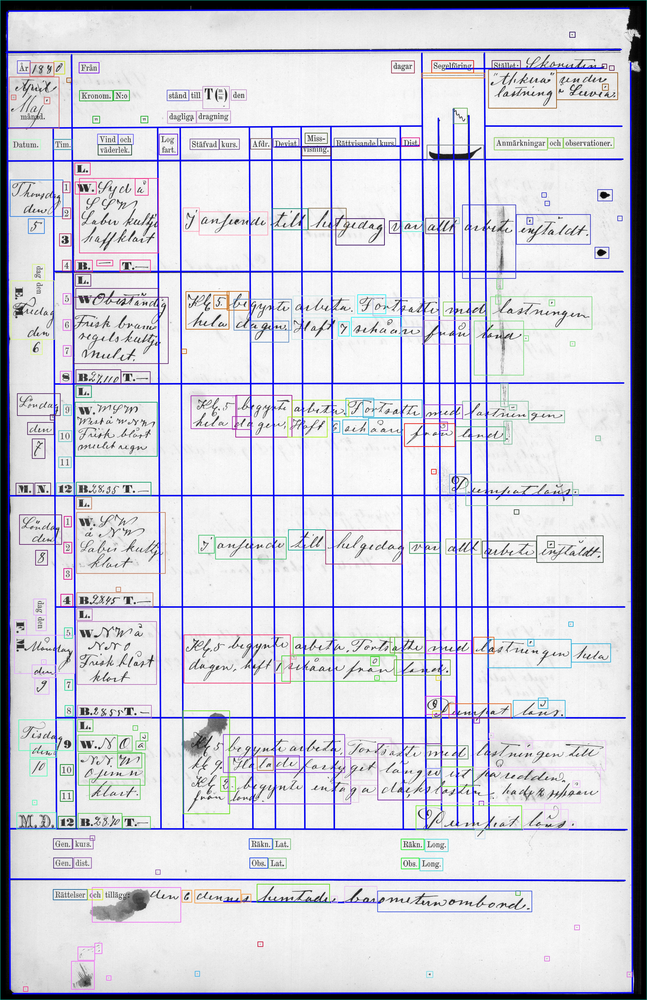

# Table segmentation



The code, provided by [Alpha Logos Software Oy](https://www.alphalogos.fi/), contains several functions that can be used for detecting table lines as well as content elements from tables in digitized document images. The code has been developed specifically to detect table lines and content elements from Finnish ship logbooks from the late 19th - early 20th centuries (see example images in [sample_logbook_data](https://github.com/DALAI-project/Table_segmentation/tree/main/sample_logbook_data) folder), and the default parameter values are optimized for that dataset. Most probably achieving good segmentation results with different datasets will require adjustment of the parameter values.

The documentation of the code is provided in a separate [documentation.pdf](https://github.com/DALAI-project/Table_segmentation/blob/main/documentation.pdf) file, and more detailed information on many of the functions and parameters can be found from the documentation of the [OpenCV](https://opencv.org/) library. 

## Installation

- Create and activate conda environment:

`conda create -n table_seg_env python=3.11`

`conda activate table_seg_env`

- Install required libraries:

`pip install -r requirements.txt`

## Running the code

Image segmentation can be performed by running the `run_main_tests.py` file using the command line. By default, the code expects input images to be located in subfolders of the `sample_logbook_data` folder, and the results are placed in subfolders of the `results` folder. When these default folder names are used and the output is chosen to include table line images, progress images, table element images and table element cell position images, the following folder structure (folder and image names used here are examples) is expected before running the code:

```
├──Table_segmentation
      ├──results 
      ├──sample_logbook_data
      |   ├──image_folder_1
      |   |   ├──img_1_1.jpg...
      |   └──image_folder_2
      |       ├──img_2_1.jpg...
      ├──run_main_tests.py
      ├──main_test_functions.py
      ├──utilities.py
      ├──requirements.txt
      ...
```
After running the code, the `results` folder content should have the following subfolders, which contain the result files:

```
├──Table_segmentation
      ├──results 
      |   ├──image_folder_1
      |   |   ├──arrays
      |   |   ├──images
      |   |   ├──progress_images
      |   |   └──numbers_of_table_elements.npy
      |   └──image_folder_2
      |       ...
      ...
```
## Parameters

There are a variety of parameters that can be provided as input arguments to the code. The arguments are listed in the `run_segment.py` file, and explanation of the technical parameters can be found in the documentation.pdf](https://github.com/DALAI-project/Table_segmentation/blob/main/documentation.pdf) file. The parameters relating to the directory paths, output files and processing type are listed below:

- `INPUT_DIR` defines the folder where the input image data is located. The image files are expected to be located in subfolders of the `INPUT_DIR`, which can be named freely by the user. Default folder path for the input directory is `./sample_logbook_data`.
- `RESULTS_DIR` defines the folder where the results of the functions are saved. The number and types of subfolders depends on the user's choice of outputs. Default results folder path is `./results`.
- `RUN_RANDOM_SAMPLE_TEST` defines whether random pages of random documents in the input folder are processed and the results displayed onscreen. Default value is `False`, whereby all the images belonging to all the document folders in the input folder are processed. If you want the value to be `True`, add `--RUN_RANDOM_SAMPLE_TEST` to the command line argument list.
- `CONSTRUCT_PROGRESS_IMAGES` defines whether images illustrating the functioning of the table line detection algorithm are created. Default value is `True`. If you want the value to be `False`, add `--CONSTRUCT_PROGRESS_IMAGES` to the command line argument list.
- `CONSTRUCT_TABLE_LINE_IMAGE` defines whether images showing the detected table lines are created. Default value is `True`. If you want the value to be `False`, add `--CONSTRUCT_TABLE_LINE_IMAGE` to the command line argument list.
- `CONSTRUCT_TABLE_ELEMENT_IMAGES` defines whether images showing the detected table elements are created. Default value is `True`. If you want the value to be `False`, add `--CONSTRUCT_TABLE_ELEMENT_IMAGES` to the command line argument list.
- `CONSTRUCT_TABLE_ELEMENT_CELL_POSITION_IMAGE` defines whether table element cell position analysis image is created. Default value is `True`. If you want the value to be `False`, add `--CONSTRUCT_TABLE_ELEMENT_CELL_POSITION_IMAGE` to the command line argument list.

The following example shows how to run the code with the default values of the above arguments:
`python run_main_tests.py`

If you want for example to change input folder name to `./input` and exclude progress images from the results, type:
`python run_main_tests.py --INPUT_DIR ./input --CONSTRUCT_PROGRESS_IMAGES`
